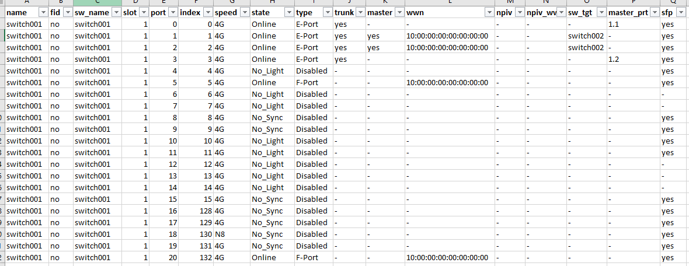

# Supportshow command parsing (BROCADE)

All these modules are coded in `Python 2.6`

The following scripts collect `Supportshow command` file and parser them to retrieve the information and write it to csv files.

## (Multithread) Collect of Command (Supportshow or other)

`fos_cmd.py` retrieves the Supportshow or any other commands on the Brocades switches and saves them locally on the host server by switch and command.

He create several switch's queue according to the location, ID and other factor (to customize) and start collect with multitread feature.

### Arguments

See list of arguments :
 * `-h|--help` : Help
 * `-d|--debug` : Debug Mode
 * `-c| -command <Command(s)>` : Command(s) to execute on chassis (Sepator: `,`)
 * `-v|--vf_command <VF Command(s)>` : Command(s) to execute per VF (Sepator: `,`)
 * `-s|--switch <Switch>` : Input switch list (Sepator: `,`)
 * `-o|--output <Output>` : Output file

### Operation

#### Chassis

The `-c|--command` argument is used in the case where a command must be started on the chassis.

For example it is useless to launch the `version` command on all the `Virtual Fabric` of a switch.

The syntax will be as follows:

```
$ ./fos_cmd.py --command version --switch switch0001 --output .
```

This one will execute the command `version` on the switch `switch0001` and create a file containing the return of the command. The file will have the following name:

```
command.switch.YYYY_MM_DD.out
```

It will be created in a directory with the current date (In the current directory `.`).

Example :
```
2018_10_11/version.switch0001.2018_10_11.out
```

#### Virtual Fabric (VF)

The `-v|--vf_command` argument is used in the case where a command must be launched on all the `VFs` of a switch.

For example, the return of the `switchshow` command is different depending on the `VF`.

The syntax will be as follows:

```
./fos_cmd.py -vf_command switchshow --switch switch0001 --output .
```

**NOTE: `-vf_command` argument can be used both on switches with VF than on other without VF.**

This one will recover the IDs of each VF of the switch (If present) and execute the command `switchshow` each then create a file containing the return of the command by `VF`. 

The files will have the following names:

```
command.switch.Id_VF.YYYY_MM_DD.out
```

**NOTE: If the switch does not have VF ID the BOM will be like the output files used with the -command argument (command.switch.YYYY_MM_DD.out).**

Example :
``` 
2018_10_11/switchshow.switch0001.10.2018_10_11.out
2018_10_11/switchshow.switch0001.20.2018_10_11.out
```

## (Multithread) Parse Port Information

`sups_port.py` parse Supportshow input files (Generate by `fos_cmd.py`) and retrieve informations related to the port (type of port, wwn, sfp) and other information on the switch (Hardware, slot, primary switch, ...).

Here is the list of the different files generated in output :

 * `listeWWN.csv` : Info about WWN and Port
 * `listeSFP.csv` : SFP Info
 * `listeSlot.csv` : Slot Info (State / SN / PN)
 * `listeCP.csv` : CP info
 * `listeHardware.csv` : Info about the hardware (Chassis / Blade)
 * `listeSwitchInfos.csv` : Other Info
 * `listeSwitchPr.csv` : Primary Switches Info (Used by zones parser `sups_zone.py`)


### Arguments

See list of argument :

 * `-h|--help` : Help
 * `-d|--debug` : Debug Mode
 * `-n|--null_value <Null Value>` : Null value at output (Default: '')
 * `-t|--thread <Thread>` : Thread Count (Default: 12)
 * `-i|--input <Input>` : Input File
 * `-o|--output <Output>` : Output Output


## (Multithread) Parse Zone/Alias Information

`sups_zone.py` parse Supportshow input files and retrieve information related to the alias/zone.

The script is based on the output file of the script `sups_port.py` which retrieves the primary switches in order to retrieve information only on them.

### Arguments

See list of argument :

 * `-h|--help` : Help
 * `-d|--debug` : Debug Mode
 * `-n|--null_value <Null Value>` : Null value at output (Default: '')
 * `-t|--thread <Thread>` : Thread Count (Default: 12)
 * `-i|--input <Input>` : Input File
 * `-o|--output <Output>` : Output Output
 
## Format and Compress final file

`sups_clean.py` retrieves the generated csv files and formats them to bind the WWNs retrieved with `sups_port.py` and aliases retrieved with `sups_zone.py`.

Also allows to archive all files (Compression `BZ2`) and push the csv to the final directory (Replacement of older file)


## Scheduler script

`sups_utils.sh` is a scheduler script allowing to execute all the scripts in the given order and to manage the return codes of each one.

This script get a file with the list of switch to collect (`sw_list.txt`). 

## Final

### Excel

See an example of output csv file (Port) :



### Tree

See an example of final tree :

```
.
├── arch
│   ├── fos_cmd
│   │   └── 2019_10_31_supshow_files.tar.xz
│   └── sup_pars
│       ├── SupShow_listeAlias_2019_10_31.csv.gz
│       ├── SupShow_listeAnomalieZone_2019_10_31.csv.gz
│       ├── SupShow_listeCP_2019_10_31.csv.gz
│       ├── SupShow_listeHardware_2019_10_31.csv.gz
│       ├── SupShow_listeOlsLrErreurs_2019_10_31.csv.gz
│       ├── SupShow_listeSFP_2019_10_31.csv.gz
│       ├── SupShow_listeSlot_2019_10_31.csv.gz
│       ├── SupShow_listeSwitchInfos_2019_10_31.csv.gz
│       ├── SupShow_listeSwitchPr_2019_10_31.csv.gz
│       ├── SupShow_listeWWN_2019_10_31.csv.gz
│       └── SupShow_listeZone_2019_10_31.csv.gz
├── logs
│   ├── fos_cmd.log
│   ├── sup_clean.log
│   ├── sup_port.log
│   └── sup_zone.log
└── output
    ├── final
    │   ├── listeAlias.csv
    │   ├── listeAnomalieZone.csv
    │   ├── listeCP.csv
    │   ├── listeHardware.csv
    │   ├── listeOlsLrErreurs.csv
    │   ├── listeSFP.csv
    │   ├── listeSlot.csv
    │   ├── listeSwitchInfos.csv
    │   ├── listeSwitchPr.csv
    │   ├── listeWWN.csv
    │   └── listeZone.csv
    ├── fos_cmd
    └── sup_pars
```
